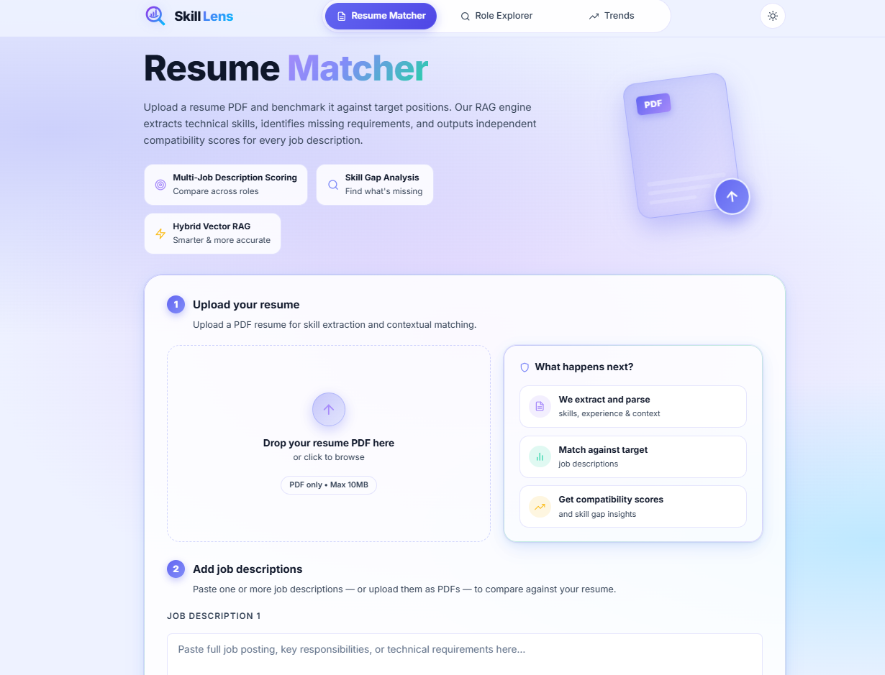
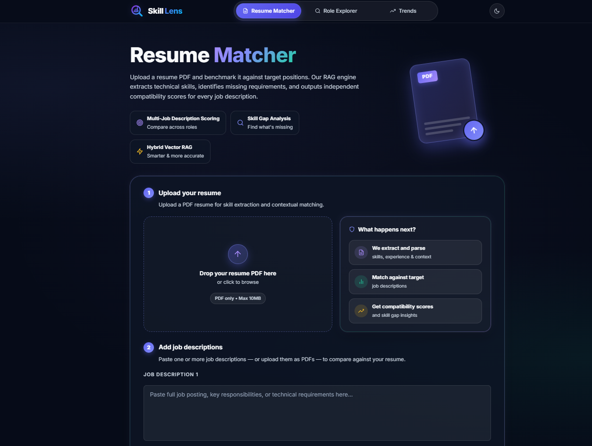
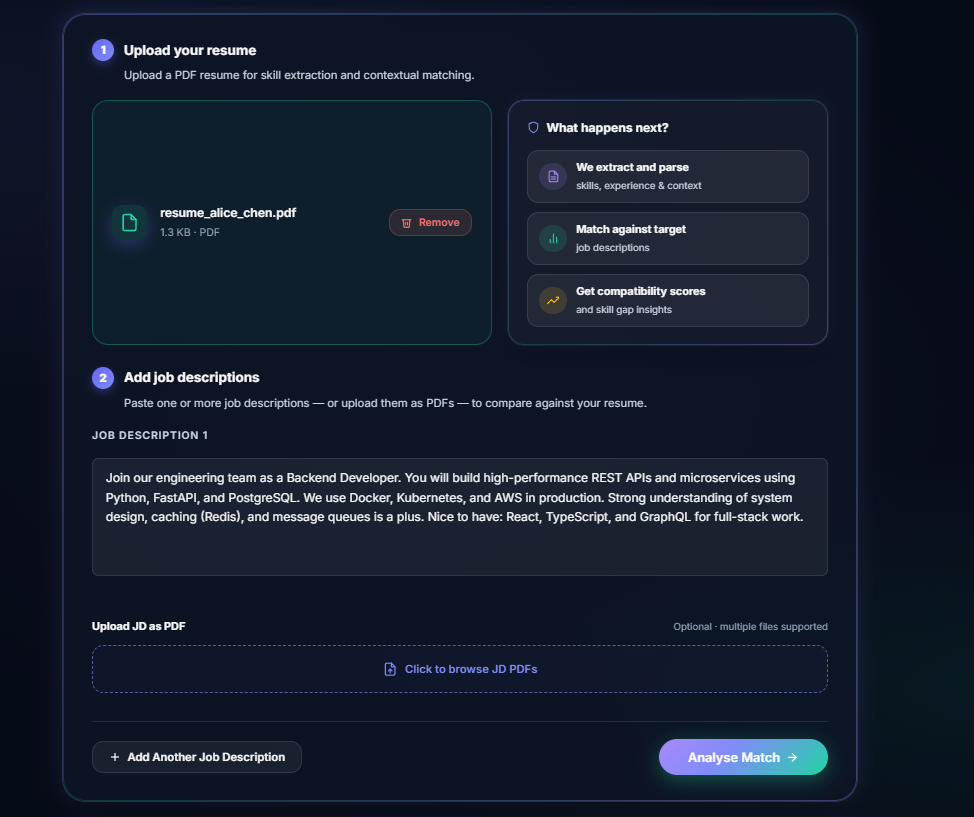
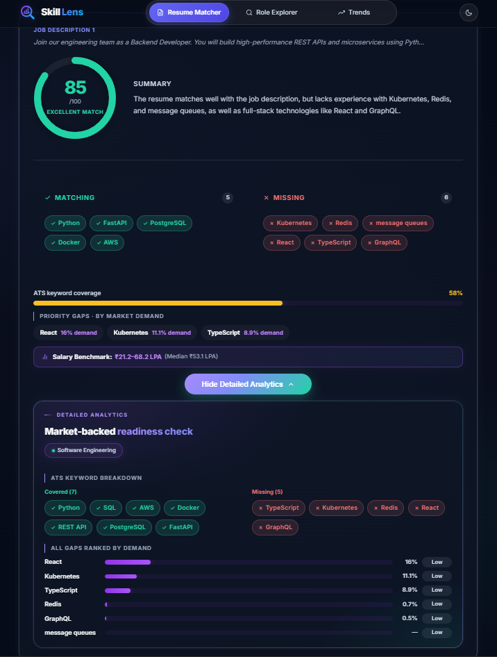
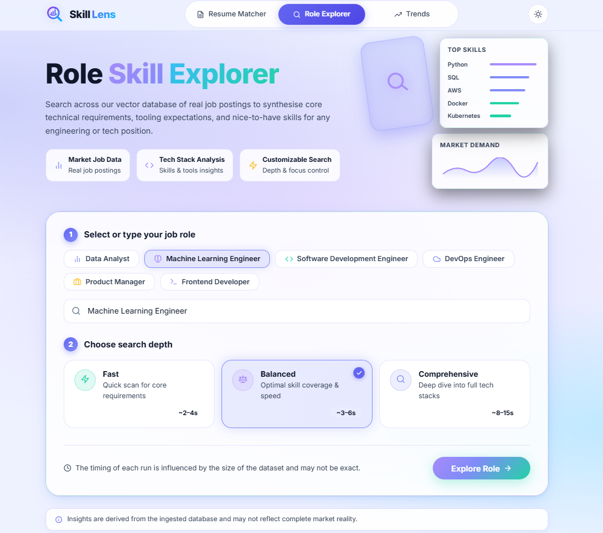
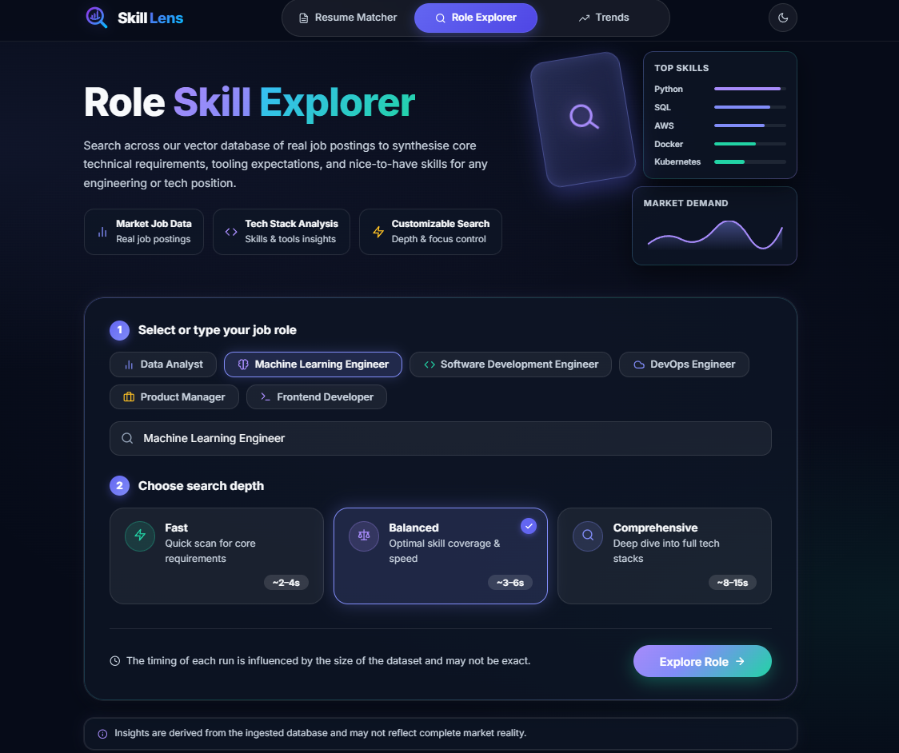
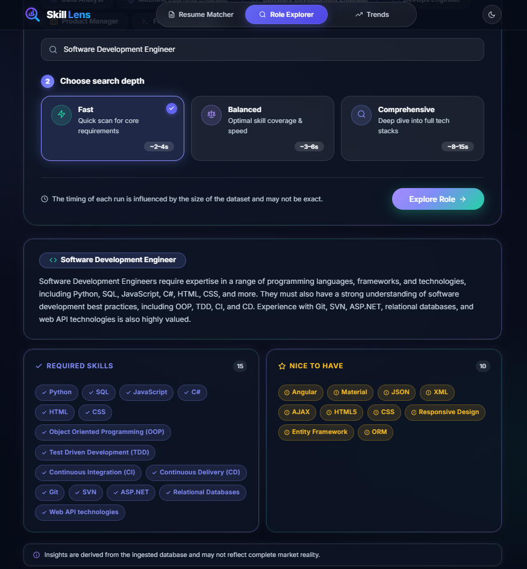
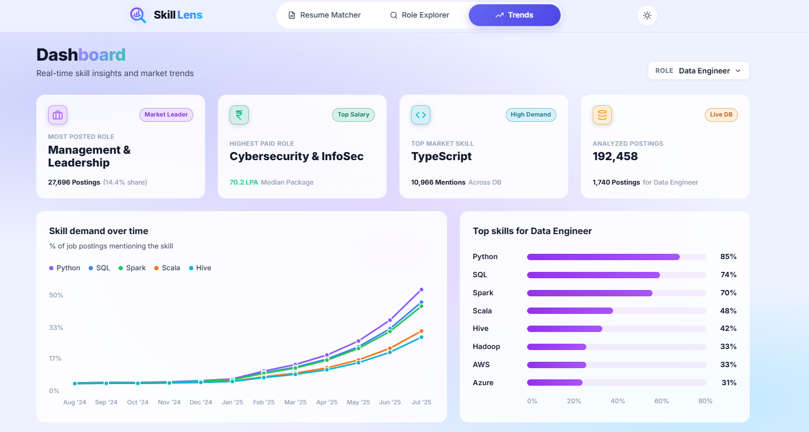
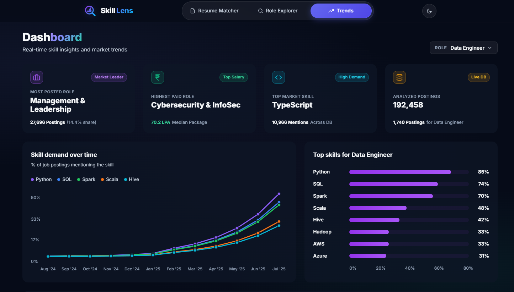
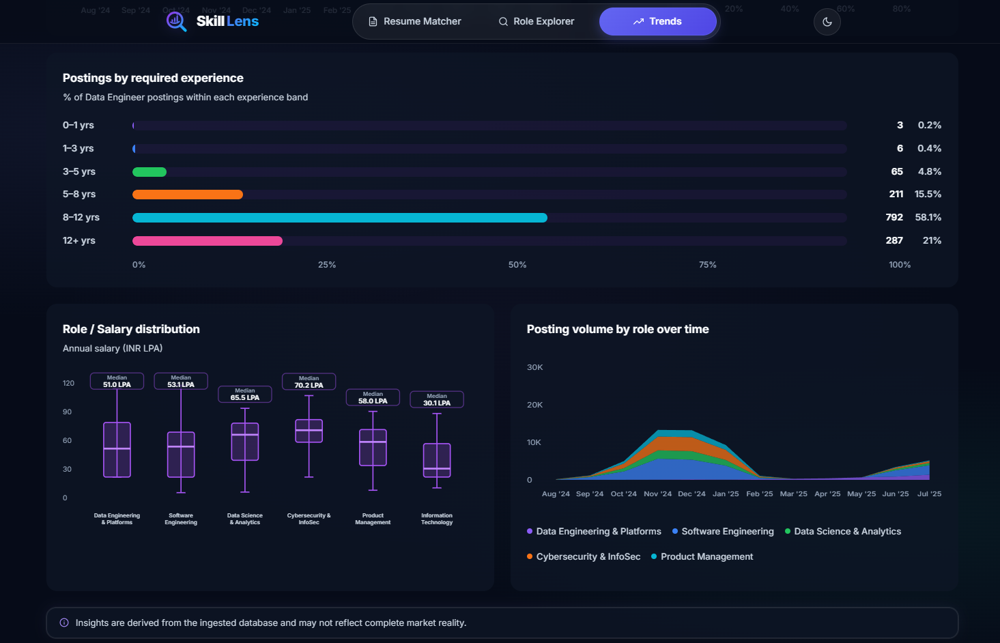

# Skill Lens — Hybrid RAG Resume Matcher

A full-stack **hybrid Retrieval-Augmented Generation (RAG)** app that benchmarks a resume against job descriptions, synthesises skill profiles for any role, and surfaces real job-market trends.

Retrieval is **hybrid**: exact-keyword **BM25** (lexical) and semantic **vector search** (ChromaDB) are fused with Reciprocal Rank Fusion, then re-ranked with a CrossEncoder before an LLM generates grounded answers.

Three features:

- **Resume Matcher** — upload a resume PDF, add one or more JDs (text or PDF), get an independent compatibility score per JD plus **market-backed detailed analytics** (ATS keyword coverage, demand-weighted skill gaps, salary band).
- **Role Skill Explorer** — ask "what does a Data Engineer need to know?" and get a synthesised skill profile retrieved via hybrid BM25 + vector search from a database of real job postings.
- **Trends Dashboard** — demand over time, salary distributions, posting volumes, and experience requirements computed from the JD database.

## Screenshots

### Landing




### Resume Matcher




### Role Skill Explorer






### Trends Dashboard






---

## Tech Stack

| Layer | Tools |
|---|---|
| Backend | Python 3.14, FastAPI, Uvicorn, `uv` |
| RAG pipeline | LangChain, ChromaDB, sentence-transformers, BM25 |
| LLM | OpenAI-compatible (OpenRouter primary / Groq fallback) |
| Analytics | pandas, numpy |
| Frontend | React 19, TypeScript, Vite, hand-rolled SVG charts |
| Deployment | Docker / Docker Compose, Nginx |

---

## Architecture

```
                 data/
  CSVs ──► ingestion ──► chunking ──► indexing (ChromaDB + BM25)
                                         │
  query ──► hybrid retrieval (BM25 + semantic) ──► CrossEncoder rerank
                                         │
                                         ▼
                    generation (LLM) ──► JSON result
```

- **LLM used only** for resume matching and role-skill synthesis.
- **Everything else is deterministic local math** (retrieval, rerank, trends, ATS coverage, salary bands) — fast, cheap, no API rate-limit risk.

---

## Quickstart — Docker

**Prereqs:** Docker Desktop running.

```bash
# 1. (optional) use the sample dataset instead of the full CSVs
powershell -File scripts/copy-samples.ps1     # PowerShell
./scripts/copy-samples.sh                     # bash

# 2. build & start
docker compose up --build

# 3. open the app
# App:      http://localhost:81
# API docs: http://localhost:8001/docs
# Health:   http://localhost:8001/api/health
```

First build takes a few minutes (installs torch, langchain, etc.). Subsequent starts are instant. The backend mounts `./data` from your machine, so the index and model cache persist across restarts.

---

## Quickstart — Local dev

**Prereqs:** Python 3.14+ and `uv` installed.

```bash
# 1. install dependencies
uv sync

# 2. environment
Copy-Item .env.example .env        # PowerShell
cp .env.example .env               # bash
# ... then fill in your keys in .env

# 3. (optional) sample data instead of full CSVs
powershell -File scripts/copy-samples.ps1

# 4. backend
uv run uvicorn api.main:app --reload --port 8000

# 5. frontend (new terminal)
cd frontend && npm install && npm run dev
# open http://localhost:5173  (proxies /api -> 127.0.0.1:8000)
```

---

## Data setup

The full datasets are **not** included in the repo (they're large and gitignored).

| Dataset | Where to get it | Notes |
|---|---|---|
| `indian_job_market_2025.csv` | Kaggle (Naukri job postings) | ~98k rows, has skills/experience/salary |
| `us_tech_jobs_2024.csv` | Kaggle (US tech jobs) | ~94k rows, no usable experience field |

Place them in `data/`. The app auto-detects columns, so schema differences are handled.

### Sample dataset (recommended for trying the app)

A **stratified 2,000-row sample** of the Indian dataset ships in `sample-data/` so you can try everything without the full CSVs:

```bash
powershell -File scripts/copy-samples.ps1     # copies sample-data/*.csv -> data/
```

> **Caution:** only copy samples into a fresh/empty `data/`. Mixing sample and full CSVs will double-count postings. Delete `data/*.csv` to reset.
>
> Sample results are **illustrative** — real market numbers need the full datasets. Regenerate the sample with `uv run python scripts/build_sample.py`.

---

## Environment variables

See `.env.example` for the template. Summary:

| Variable | Required | Purpose |
|---|---|---|
| `LLM_PROVIDER` | optional | `openrouter` (default) or `groq` |
| `OPENROUTER_API_KEY` | for LLM | Primary LLM key (https://openrouter.ai/keys) |
| `GROQ_API_KEY` | for LLM | Fallback LLM key (https://console.groq.com/keys) |
| `HF_TOKEN` / `HUGGING_FACE_HUB_TOKEN` | optional | For gated HF models |
| `REINDEX_DEVICE` | optional | `cuda` to GPU-rebuild the index (see below) |

**Never commit `.env`.** It is gitignored.

---

## API reference

All endpoints are under `/api`.

| Method | Path | Description |
|---|---|---|
| GET | `/api/health` | Liveness check → `{"status": "ok"}` |
| POST | `/api/match` | Resume × JD matcher. `multipart/form-data`: `resume` (PDF), `jd_texts` (JSON array of strings), optional `jd_files` (JD PDFs). Returns one result per JD. |
| POST | `/api/explore` | Role skill explorer. JSON `{role, top_k}` → required/nice-to-have skills + summary. |
| POST | `/api/trends` | Trends for a role. JSON `{role, time_range}` → dashboard payload. |
| POST | `/api/trends/rebuild-cache` | Rebuild the trends analytics cache in the background. |
| GET | `/api/trends/cache-status` | How many roles are cached, is a build running. |

### Example — match

```bash
curl -X POST http://localhost:8001/api/match \
  -F "resume=@resume.pdf" \
  -F 'jd_texts=["We need a Senior Data Engineer with Python, SQL, Spark, AWS"]'
```

Response per JD: `match_score`, `matching_skills`, `missing_skills`, `summary`, plus the LLM-free insights: `ats_coverage`, `prioritized_gaps`, `salary_band`, `role_category`, `database_size`, and `jd_source`/`jd_filename` (for PDF JDs).

---

## Indexing: build vs incremental vs rebuild

### Does it support incremental indexing?

**Yes** — via `scripts/add_docs.py`. It adds new documents to the **existing** ChromaDB index without disturbing any existing embeddings, and keeps `chunks_cache.pkl` in sync so the BM25 index picks the new docs up on restart.

```bash
# add a CSV, PDF, or a whole directory of either
uv run python scripts/add_docs.py path/to/new_jds.csv
uv run python scripts/add_docs.py path/to/other.csv path/to/resume.pdf
uv run python scripts/add_docs.py path/to/folder
```

- **Duplicate guard:** any `source_id` already in the index is skipped (`--allow-duplicates` to force re-add).
- **After adding, restart the server** so BM25 rebuilds with the new chunks.

### Full rebuild (when data changes a lot)

The JD index (ChromaDB + BM25) builds **lazily on the first request** after server start. Force a full rebuild by restarting with:

```bash
FORCE_REBUILD=1 uv run uvicorn api.main:app --reload --port 8000    # bash / PowerShell: $env:FORCE_REBUILD="1"
```

or in code: `build_jd_index(force_rebuild=True)`.

> The **trends** cache is separate — rebuild it live with `POST /api/trends/rebuild-cache` (no restart needed).

### Adding a few files without disturbing existing embeddings

Exactly what `add_docs.py` does: it loads the existing index, appends only new chunks (deduped by `source_id`), and never re-embeds what's already there.

---

## GPU re-indexing (optional)

By default everything runs on CPU (lean Docker image, ~1.1 GB). The **only** GPU path is the bulk re-embed during a full rebuild:

```bash
# 1. install a CUDA build of torch (once)
uv pip install --reinstall torch --index-url https://download.pytorch.org/whl/cu130

# 2. rebuild the index on the GPU
REINDEX_DEVICE=cuda uv run python -c "from main import build_jd_index; build_jd_index(force_rebuild=True)"
```

If CUDA is unavailable, it logs a warning and falls back to `cpu`. Runtime query embedding and reranking stay on CPU. A GPU-built index serves fine from CPU afterward (embeddings are model-specific, not device-specific).

---

## Project structure

```
RAG/
├── main.py                  # orchestrator + CLI demo
├── api/                     # FastAPI app, state, routers
│   ├── main.py              # app factory, CORS, /api/health
│   ├── state.py             # lazy singleton JD index/retriever
│   └── routers/             # matcher, explorer, trends
├── src/
│   ├── ingestion.py         # PDF/CSV loading, role classification
│   ├── chunking.py          # recursive text splitter
│   ├── indexing.py          # ChromaDB + BM25, GPU-aware rebuild
│   ├── retrieval.py         # hybrid ensemble + CrossEncoder rerank
│   ├── generation.py        # LLM calls, JSON schema, provider failover
│   ├── analytics.py         # trends metrics (demand, salary, volume)
│   ├── trends_cache.py      # disk-backed analytics cache
│   └── market_insights.py   # LLM-free ATS/gaps/salary (Detailed Analytics)
├── scripts/
│   ├── add_docs.py          # safe incremental indexing
│   ├── build_sample.py      # regenerate the stratified sample
│   ├── copy-samples.ps1     # copy sample -> data/
│   └── copy-samples.sh
├── frontend/                # React 19 + Vite + TS
│   ├── src/pages/           # Matcher, Explorer, Trends
│   └── Dockerfile, nginx.conf
├── sample-data/             # 2000-row Indian sample (committed)
├── data/                    # gitignored: CSVs, index, caches, models
├── docs/MASTER.md           # deep-dive + interview prep
├── Dockerfile, docker-compose.yml
└── .env.example             # env template
```

---

## Common issues

- **Port already in use (8000/5173 or 8001/81):** either Docker or local dev is running — stop one:
  - Stop Docker: `docker compose down`
  - Stop local: Ctrl+C in the terminals
- **First startup slow:** downloading two small models from Hugging Face into `data/hf_cache/` (persisted after that).
- **"No matching data" in explorer:** the role had no JD chunks above the relevance threshold — the app returns an explicit empty state rather than hallucinating.
- **Trends empty on very first run:** the background cache build is still running — check `GET /api/trends/cache-status`.

---

## Docs

`docs/MASTER.md` is a single deep-dive covering the full pipeline, every parameter, design decisions, failure modes, and interview prep.
